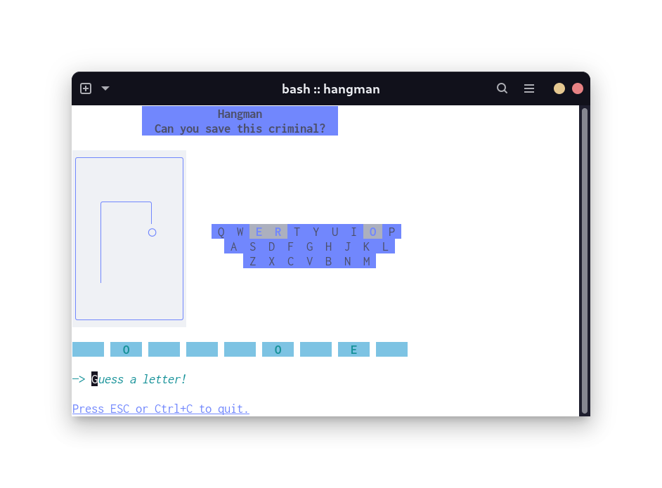

# hangman
A Go TUI [Hangman](https://www.wikihow.com/Play-Hangman) game built with the lovely [BubbleTea](https://github.com/charmbracelet/bubbletea) framework.

This project exists to teach myself Go and learn about BubbleTea because it looks like an understandable, powerful, and pleasing looking TUI framework. My past attempt at a [TUI in Python](https://github.com/braheezy/pyrdle) didn't go so well. It's already going much better with this project :)

## Installation
The easiest way to run `hangman` is to use one of the [pre-compiled binaries](https://github.com/braheezy/hangman/releases) in the Releases.

Or install it with `go`:

    go install github.com/braheezy/hangman@latest

Or from source, clone the project and run:

    go run main.go

Enjoy!

## Feature Status :partying_face:
The following is to be implemented:
- [x] End game lose condition :face_with_head_bandage:
    - Yes, right now if you can't solve the word, the program crashes
- [x] Show guessed letters :b::a:
    - The user can't see which letters are guessed which is awkward when playing
- [x] Beautification :sunglasses:
    - Add Style to:
        - [x] Hangman graphic
        - [x] Hangman flashing on guesses
        - [x] User input area
        - [x] Header
        - [x] Footer
        - [x] Guesses
        - [x] Banner area and the various messages that appear there
- [x] Clear terminal screen :boom:
    - Before launching, clear the entire screen for maximum cleanliness
- [x] Sanitize better :earth_americas:
    - Characters like `.` and nothing are deemed okay. That's stupid
- [x] Show word on loss :face_with_head_bandage:
    - Don't leave them hanging!
- [x] Support light mode terminals :angel:
    - It works okay but it could be better for heathens using light color themes
- [x] Handle screen resizing better :straight_ruler:
    - In `View()` use knowledge of window dimensions to smartly draw things:
        - [x] If the keyboard doesn't fit, remove it
        - [x] If the title doesn't fit, hide it
        - [x] If the board tiles are too long, wrap them. This has been seen with long (10+ characters) words to guess.
- [ ] Allow users to change theme :art:
    - Port the current color code definitions to some type of config file (YAML?)
    - Read the file at runtime
- [x] Build and distribute binaries :construction:
    - [x] Provide build instructions for eager beavers
    - [x] Make binaries and add to Releases
    - [x] CI/CD everything above
- [ ] Decide if implementing a scalable Difficulty mode is worth it

## More
Light mode support :partying_face:

## Contributing
Please contribute! For small things, please fork and open a PR. For large changes, please submit an Issue first.
