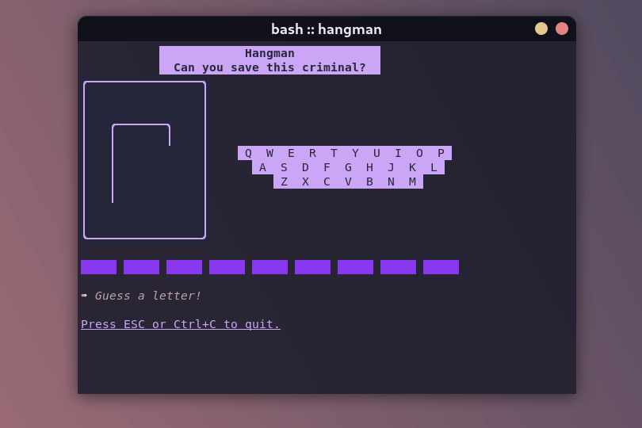

# Hangman
A Go TUI [Hangman](https://www.wikihow.com/Play-Hangman) game built with the lovely [BubbleTea](https://github.com/charmbracelet/bubbletea) framework.

This project exists to teach myself Go and learn about BubbleTea because it looks like an understandable, powerful, and good looking TUI framework. My past attempt at a [TUI in Python](https://github.com/braheezy/pyrdle) didn't go so well. It's already going much better with this project :)

## Usage
For now, clone the project and then run:
```console
go run main.go
```

Enjoy!

## Status
The following is to be implemented:
- [x] End game lose condition :face_with_head_bandage:
    - Yes, right now if you can't solve the word, the program crashes
- [x] Show guessed letters :b::a:
    - The user can't see which letters are guessed which is awkward when playing
- [ ] Beautification :sunglasses:
    - Add Style to:
        - [x] Hangman graphic
        - [x] Hangman flashing on guesses
        - [ ] User input area
        - [x] Header
        - [ ] Footer
        - [x] Guesses
        - [ ] Banner area and the various messages that appear there
- [x] Clear terminal screen :boom:
    - Before launching, clear the entire screen for maximum cleanliness
- [x] Sanitize better :earth_americas:
    - Characters like `.` and nothing are deemed okay. That's stupid
- [x] Show word on loss :face_with_head_bandage:
    - Don't leave them hanging!
- [ ] Support light mode terminals :angel:
    - It works okay but it could be better for heathens using light color themes
    - Lipgloss has `AdaptiveColor` for this support
